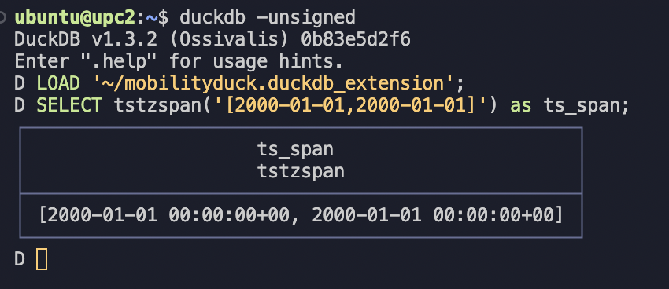

MobilityDuck
===============

[MEOS (Mobility Engine, Open Source)](https://www.libmeos.org/) is a C library that enables the manipulation of
temporal and spatiotemporal data based on [MobilityDB](https://mobilitydb.com/)'s data types and functions.

MobilityDuck is a binding for [DuckDB](https://duckdb.org/) built on top of MEOS.


The MobilityDB project is developed by the Computer & Decision Engineering Department of the [Université libre de Bruxelles](https://www.ulb.be/) (ULB) under the direction of [Prof. Esteban Zimányi](http://cs.ulb.ac.be/members/esteban/). ULB is an OGC Associate Member and member of the OGC Moving Feature Standard Working Group ([MF-SWG](https://www.ogc.org/projects/groups/movfeatswg)).


This repository is based on https://github.com/duckdb/extension-template.

With MobilityDuck, users can use these data types and functions directly in DuckDB queries. 

---
## 1. Requirements
MobilityDuck needs some dependencies(including MEOS) which can be installed through VCPKG. Run the following to enable it: 

```sh
cd <your-working-dir-not-the-plugin-repo>
git clone https://github.com/Microsoft/vcpkg.git
sh ./vcpkg/scripts/bootstrap.sh -disableMetrics
export VCPKG_TOOLCHAIN_PATH=`pwd`/vcpkg/scripts/buildsystems/vcpkg.cmake
```

---
## 2. Building MobilityDuck
### Clone the repository
```sh
git clone --recurse-submodules https://github.com/MobilityDB/MobilityDuck.git
```
Note that `--recurse-submodules` will ensure DuckDB is pulled which is required to build the extension.

### Build steps
To build the extension, from the root directory (`mobilityduck`), run:
```sh
make
```

Or use `ninja` for faster build (subsequent builds after the first build) relying on cache:
```sh
GEN=ninja make
```
The main binaries that will be built are:
```sh
./build/release/duckdb
./build/release/test/unittest
./build/release/extension/mobilityduck/mobilityduck.duckdb_extension
```
- `duckdb` is the binary for the duckdb shell with the extension code automatically loaded.
- `unittest` is the test runner of duckdb. Again, the extension is already linked into the binary.
- `mobilityduck.duckdb_extension` is the loadable binary as it would be distributed.

## 3. Using the extension

### 3.1. DuckDB shell with built-in extension
If you build MobilityDuck from source code using the steps above, after the build completes, you can start using MobilityDuck from the DuckDB shell with the extension code automatically loaded. The shell binary is available at ```./build/release/duckdb```.

From the main repository, you can run the DuckDB shell with:
```bash
MobilityDuck$ ./build/release/duckdb
```

All implemented MEOS types and functionalities can readily be used:

<center></center>

This shell can be used with a persistent in-memory database by adding an argument:
```bash
MobilityDuck$ ./build/release/duckdb [name of db].db
```

### 3.2. DuckDB shell without built-in extension

If DuckDB is available on your machine ([installed independently](https://duckdb.org/install/), unrelated to MobilityDuck) and can be called by ```duckdb```, the MobilityDuck extension binary can be loaded later. **Prerequisite**: the independent DuckDB version and the DuckDB version of the build must be identical.

If you build MobilityDuck from source code, the loadable extension binary is available at ```./build/release/extension/mobilityduck/mobilityduck.duckdb_extension```.

Alternatively, you can download a pre-build extension binary from the list below:

|   Platform   | Download |
|:------------:|:--------:|
|  Linux amd64 |   [link](https://github.com/MobilityDB/MobilityDuck/actions/runs/18434422523/artifacts/4245778529)   |
|  Linux arm64 |   [link](https://github.com/MobilityDB/MobilityDuck/actions/runs/18434422523/artifacts/4245766052)   |
|  macOS amd64 |   [link](https://github.com/MobilityDB/MobilityDuck/actions/runs/18434422523/artifacts/4245766466)   |
|  macOS arm64 |   [link](https://github.com/MobilityDB/MobilityDuck/actions/runs/18434422523/artifacts/4245755693)   |
|    Wasm EH   |   [link](https://github.com/MobilityDB/MobilityDuck/actions/runs/18434422523/artifacts/4245801049)   |
|   Wasm MVP   |   [link](https://github.com/MobilityDB/MobilityDuck/actions/runs/18434422523/artifacts/4245792712)   |
| Wasm threads |   [link](https://github.com/MobilityDB/MobilityDuck/actions/runs/18434422523/artifacts/4245788096)   |

To use your independent DuckDB shell, first, run the shell with an additional flag:
```bash
$ duckdb -unsigned
```

Within the shell, load MobilityDuck by calling ```LOAD``` and the path to the extension binary. Then, the MEOS types and functionalities should be available:

<center></center>

### 3.3. Python API

The extension binary can be helpful if you want to use MobilityDuck in Python via DuckDB’s [Python API](https://duckdb.org/docs/stable/clients/python/overview). **Prerequisite**: the version of the DuckDB Python client and the DuckDB version of the build must be identical.

The extension can be loaded using:
```python
import duckdb

connection = duckdb.connect(
    config={'allow_unsigned_extensions' : 'true'}
)

connection.load_extension('path-to-extension-binary')
```

Now the MEOS types and functionalities can be used:

```python
query = "SELECT asText(floatspanset '{[1.55, 2.55], [4, 5]}', 0);"
result = connection.execute(query)
result.fetchall()
# [('{[2, 3], [4, 5]}',)]
```

### 3.4. Sample queries

- Return the time interval of a temporal type:
    ```sql
    SELECT duration('{1@2025-01-01, 2@2025-01-02, 1@2025-01-03}'::TINT, true);
    -- 2 days
    ```
- Shift and scale a ```timestamptz``` set by specific time intervals:
    ```sql
    SELECT shiftScale(tstzset '{2025-01-01, 2025-01-02, 2025-01-03}', '1 day', '1 hour');
    -- {"2025-01-02 00:00:00+00", "2025-01-02 00:30:00+00", "2025-01-02 01:00:00+00"}
    ```
- Transform a geometry set to a different spatial reference identifier:
    ```sql
    SELECT asEWKT(transform(geomset 'SRID=4326;{Point(2.340088 49.400250), Point(6.575317 51.553167)}', 3812), 6);
    -- SRID=3812;{"POINT(502773.429981 511805.120402)", "POINT(803028.908265 751590.742629)"}
    ```
- Expand the spatial dimension of a spatiotemporal bounding box by a value:
    ```sql
    SELECT expandSpace(stbox 'STBOX XT(((1.0,2.0), (1.0,2.0)),[2025-01-01,2025-01-01])', 2.0);
    -- STBOX XT(((-1,0),(3,4)),[2025-01-01 00:00:00+00, 2025-01-01 00:00:00+00])
    ```
- Expand the temporal dimension of a bounding box by an interval:
    ```sql
    SELECT expandTime(tbox 'TBOXFLOAT XT([1.0,2.0], [2025-01-01,2025-01-02])', interval '1 day');
    -- TBOXFLOAT XT([1, 2],[2024-12-31 00:00:00+00, 2025-01-03 00:00:00+00])
    ```
- Create a temporal geometry with a point, time span, and step interpolation:
    ```sql
    SELECT asEWKT(tgeometry('Point(1 1)', tstzspan '[2025-01-01, 2025-01-02]', 'step'));
    -- [POINT(1 1)@2025-01-01 00:00:00+00, POINT(1 1)@2025-01-02 00:00:00+00]
    ```
- Check if a temporal point geometry overlaps with a spatiotemporal bounding box:
    ```sql
    SELECT tgeompoint '{[Point(1 1)@2025-01-01, Point(2 2)@2025-01-02, Point(1 1)@2025-01-03], [Point(3 3)@2025-01-04, Point(3 3)@2025-01-05]}' && stbox 'STBOX X((10.0,20.0),(10.0,20.0))';
    -- false
    ```
- Restrict a temporal point geometry to a ```timestamptz``` span:
    ```sql
    SELECT asText(atTime(tgeompoint '{[Point(1 1)@2025-01-01, Point(2 2)@2025-01-02, Point(1 1)@2025-01-03],[Point(3 3)@2025-01-04, Point(3 3)@2025-01-05]}', tstzspan '[2025-01-01,2025-01-02]'));
    -- {[POINT(1 1)@2025-01-01 00:00:00+00, POINT(2 2)@2025-01-02 00:00:00+00]}
    ```

## 4. Running the tests
Test files are located in `./test/sql`. These SQL tests can be run using:
```sh
make test
```
